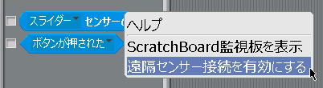

## Scratch遠隔センサープロトコル(Remote Sensors Protocol, RSP)のPython3 / Scratch 1.4によるテストコード
([English version is hear. 英語版はこちら。](./README.md))


## とにかく試してみたい人（ラズパイで）
1. Scratch 1.4を起動、サンプルプロジェクト ```RSP_remote_sensors_protocol.sb``` を開き、緑色の旗をクリックしてスタート。
2. LTXerminalを開き、 ```python3 listen_to_scratch.py``` と入力、Listenerコードを起動。
3. もう一つ、LTXerminalのウィンドウを開き、 ```python3 talk_to_scratch.py``` と入力、Talkerコードを起動。
4. Scratchで、遠隔センサープロトコルのポート経由、緑のドラゴンを使って送信（話す）、Scratchネコを使って受信（聴く）。
6. Talkerでメッセージ「hello」や「こんにちは」を送信してみる。
7. Scratch側で、メッセージを送ったり、変数の値を変化させたりして、Listenerの表示を見る。
5. 変数は、「全てのスプライト用」であること、センサー更新情報は変数の値が実際に変化した時だけ送信されることに注意。同じ値を連続して送信することはできない。任意のデータを確実に送るためには、本当に送りたいデータの前にダミーデータを送るなど工夫する。
6. メッセージに日本語を使っても大丈夫。変数名／変数値、センサー名／センサー値に日本語を使うとラズパイ以外では不具合が発生、動作がとても遅くなったり、エラーメッセージが表示されたりする場合がある。


### [Talkerコード](talk_to_scratch.py)で、メッセージやセンサー値の更新をScratchに伝える（話す）ことができる：

 1. Scratch 1.4 が走っているコンピューターの名前（ホスト名とも呼ばれる）を接続先として入力する。エンターキーだけ押した場合は、"localhost"が設定され、このPythonコードが走っているコンピューター自身のScratchと接続を試みる。
 - RSP接続に成功すると、メッセージ入力モードになる。
    - メッセージを入力してScratchへ送る。日本語メッセージも大体は大丈夫。
    - Scratchは、やって来たメッセージをハット型の [(メッセージ)を受け取ったとき]ブロックで受け取る。
 - メッセージ入力モードでエンターキーだけを押すと、センサー更新モードに入る。
    - センサー名と値を入力してScratchへ送る。日本語名はラズパイだったら大体は大丈夫。Macはダメっぽい。
    - Scratch側では [(センサー名) センサーの値] で値を知ることができる。
 - 再び、メッセージ入力モードに戻る。終了するときは、ctrl-cを押す。
 - Scratchは、RSP経由で入ってきた情報をそのまま、RSPで送り出す。

### [Listenerコード](listen_to_scratch.py)で、Scratchからのメッセージや変数の更新情報を受け取る（聴く）ことができる：

 1. Scratch 1.4 が走っているコンピューターの名前（ホスト名とも呼ばれる）を入力する。エンターキーだけ押すとlocalhostが設定され、このPythonコードが走っているコンピューター自身のScratchと接続を試みる。
 - Scratchは、グローバル変数（全てのスプライト用）の値が **実際に変化した時** に、センサー値更新メッセージをRSPで送り出す。日本語名はラズパイだったら大体は大丈夫。Macはダメっぽい。
 - Scratchは、[(メッセージ)を送る]ブロックによってメッセージを送ると同時にRSPでも送り出す。
 - Listenerコードは、Scratchからの情報を表示する。
 - 終了するときは、ctrl-cを押す。

### マルチバイト文字について
 - UTF-8は、マルチバイト文字が2バイトから4バイトになる。古い規格だと6バイトまで。
 - 日本語はほとんどは3バイトで一部が4バイト。
 - 仮名漢字の日本語はほとんど3バイト。絵文字は4バイトなど。
 - Talkerは、メッセージのバイト数をカウントし、メッセージの先頭に付けて送出する。

### Mac版Scratch 1.4の場合
 - メッセージに日本語を使っても問題ない。
 - 変数名、変数値に日本語を使っても表示できる。
 - センサー名、センサー値に日本語を使うと、Scratch上でどちらもascii表示になり文字化けする。
 - メッセージの日本語は問題ないが、変数、センサー値に日本語を使うと動作が全体的に遅くなる。


### Scratchの挙動
 - RSPサーバーとして動いていて、複数のTalker/Listenerからクライアントとしての接続を受け付ける。
 - RSP経由でTalkerから入ってきた情報を受け取り、そのまま、RSP経由で送出している。つまり、Listenerでもあり、Talkerでもある。そのため、あるTalkerのメッセージは、全てのListenerが聴くことができる。
 - あるTalker/Listenerからの接続が確立された時、全てのグローバル変数の値をSensor-updateとして送出している。すべてのListenerが同じ情報を共有できることになる。
 - 実は、ScratchはRSPクライアントとして動かすこともできる。この場合、ホスト（サーバー）になったScratchに、他のScratchがクライアントとしてJoin（参加）することができる。「scratch mesh接続」でググってみよう！  ラズパイ同士だと簡単に実現できる。MacやWindowsだと、ちょっと面倒。

### 同じネットワーク内なら、コンピューターの間での通信が可能
 - 同じコンピューターでも良いが、同じネットワーク内の他のコンピューターとの間でも送信／受信ができる。
 - his-raspi.localなどの名前指定か、192.168.1.32などのIPアドレス指定ができる。
 - 名前による指定は、ラズパイなどのLinuxコンピューター、macOS(Unix)、iPhone / iPadだけで可能。AndroidやWindowsの場合は、IPアドレスで指定する。
 - iPhone / iPadアプリのPythonista 3（無料じゃないけど）を使えば、Scratchをリモコンできる。


## 動作の仕組みをScratchの新規プロジェクトから
### [Talkerコード](talk_to_scratch.py)

 1. Scratch　1.4を起動、[(スライダー)センサーの値]ブロックを右クリックして出てくるメニューで、「遠隔センサー接続を有効にする」をクリック。「遠隔センサー接続を有効にしました」というダイアログウィンドウが出た場合は、[OK]をクリック。<br />
 
 2. ネコのスクリプトで、[(hello)を受け取ったら]というハットブロックを作り、その下に何かネコの動作を用意する。例えば、[(ニャー)という音を鳴らす]、[(ハロー)と（2）秒言う]、[(60)度回す]など。
 3. 以下のようにLXTernimalに打ち込んで、Talkerコードを起動。
```
$ python3 talk_to_scratch.py
```
 4. ホスト名あるいはIPアドレスを聞いてくるので、エンターキーを押す。
 5. Scratchとつながったというメッセージが出るので、helloと打ち込んでエンター。
 6. Scratchネコが[(hello)を受け取ったら]のブロックに応じて動く。


### [Listenerコード](listen_to_scratch.py)

 1. Scratch側の準備はTalkerコードと同じ。
 ```
 $ python3 listen_to_scratch.py
 ```
 2. ScratchとTalkerコードからの通信を表示することができる。
- 両方から
     - [(メッセージ)を送る]
- Scratchのみ
     - [(グローバル変数) を (値)にする]
     - [(グローバル変数) を (変化量)ずつ変える]
- Talkerコードのみ
     - [(センサー名) センサーの値]


#### 受信例
```
bytes received: 16 <message|broadcast "1234"|EOL>
bytes received: 17 <message|broadcast "hello"|EOL>
bytes received: 24 <message|sensor-update "G1" 1234 |EOL>
bytes received: 36 <message|sensor-update "G1" "1234c123456789" |EOL>
bytes received: 46 <message|sensor-update "G1" "1234c123456789c123456789" |EOL>
bytes received: 56 <message|sensor-update "G1" "1234c123456789c123456789c123456789" |EOL>
bytes received: 27 <message|broadcast "こんにちは"|EOL>
```

センサー値更新はグローバル変数が違う値に変化した時のみ発行されます。また、連続した値の変化はパックされるので、フォーマットを統一したい時には[(0)秒待つ]などのブロックで分離する。

メッセージは、毎回同じでも発行されます。


## Scratch-RSPのプロトコル
遠隔センサー通信が有効な時、ScratchはTCP通信のポート42001で待ち受けている。ListenerやTalkerとの接続が確立されると以下のようなプロトコルで双方向通信が行われる。

```
<size: 4 bytes><msg: size bytes>

00 00 00 11 b r o a d c a s t SP " h e l l o "
00 00 00 18 s e n s o r - u p d a t e SP " G 1 " SP 1 2 3 4 SP

SP: space character
```
先頭4バイト（16進数8桁、ビッグエンディアン）でメッセージの文字数。
続いて、バイト列（バイナリー、UTF-8エンコーディング）でメッセージ本体。
文字数には先頭4バイトを含まない。

# Sample codes to broadcast a message in Scratch-RSP by offical

## In Python 2

 - https://en.scratch-wiki.info/wiki/Communicating_to_Scratch_via_Python_with_a_GUI

```
def sendScratchCommand(cmd):
    n = len(cmd)
    a = array('c')
    a.append(chr((n >> 24) & 0xFF))
    a.append(chr((n >> 16) & 0xFF))
    a.append(chr((n >>  8) & 0xFF))
    a.append(chr(n & 0xFF))
    scratchSock.send(a.tostring() + cmd)    
```

## In Python 3

 - https://en.scratch-wiki.info/wiki/Communicating_to_Scratch_via_Python

In Python 3, you can make it much simpler using int.to_bytes() method like below:

```
def sendCMD(cmd):
    sock.send(len(cmd).to_bytes(4, 'big'))
    sock.send(bytes(cmd, 'UTF-8'))
```

### int to byte in Python 2 and Python 3

 - https://www.delftstack.com/howto/python/how-to-convert-int-to-bytes-in-python-2-and-python-3/

You can use struct.pack() method for both Python 2 and Python 3. Yay!

```
import struct

print(len(cmd).to_bytes(4, 'big'))
print(struct.pack(">I",len(cmd)))
```

But be careful, sock.send() method had changed...
```
In Python 2:
    a = struct.pack(">I",len(cmd))
    scratchSock.send(a.tostring())
    scratchSock.send(cmd)           // to send str as bytes

In Pythin 3:
    sock.send(struct.pack(">I",len(cmd)))   
    sock.send(bytes(cmd, 'UTF-8'))  // to send bytes
```    


# Remote Sensors Protocol Documents

## Official wiki
 - https://en.scratch-wiki.info/wiki/Remote_Sensor_Connections
 - http://wiki.scratch.mit.edu/wiki/Remote_Sensors_Protocol
## Official sample codes
 - https://en.scratch-wiki.info/wiki/Communicating_to_Scratch_via_Python_with_a_GUI (Python 2)
 - https://en.scratch-wiki.info/wiki/Communicating_to_Scratch_via_Python (Python 3)

## blog.champierre.com (Junya Ishihara)

1. https://blog.champierre.com/1047
2. https://blog.champierre.com/1048
3. https://blog.champierre.com/1049
4. https://blog.champierre.com/1050
5. https://blog.champierre.com/1051

## node module (YOKOBOND)
scratch-rsp
 - https://www.npmjs.com/package/scratch-rsp
 - https://github.com/yokobond/node-scratch-rsp

## Scratch Remote Sensor Protocol via UDP (YOKOBOND)
https://lab.yengawa.com/2015/12/11/scratch-remote-sensor-protocol-on-udp/
